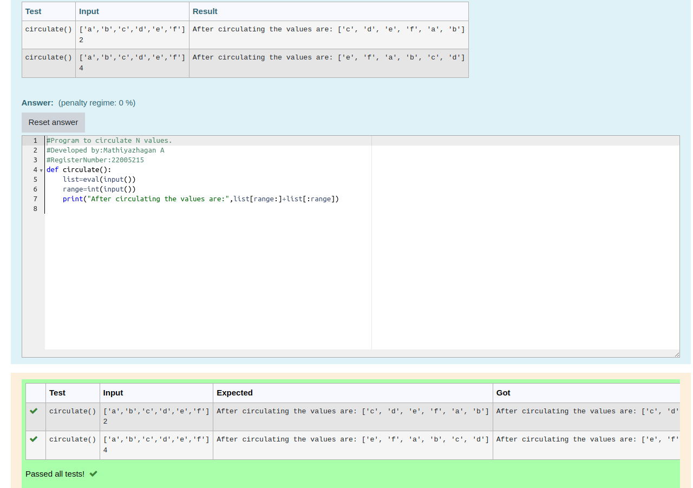

# Circulate-the-values-of-N-variables

## Aim:
To write a python program to circulate the n variables using function concept

## Equipment’s required:

PC Anaconda - Python 3.7

## Algorithm: 

### Step 1: 
create a function with keyword and name

### Step 2: 
get input for the variable list and range 

### Step 3: 

Get the value from the user for the number of rotation

### Step 4: 

Using the slicing concept rotate the list


### Step 5: 
The circulated number will be recieved

### Step 6: 
End the program

## Program:
```python
#program to circulate N values
#Developed by: Mathiyazhagan A
#Registernumber: 22005215
def circulate():
    list=eval(input())
    range=int(input())
    print("After circulating the values are:",list[range:]+list
    [:range])
``` 

## Output:

## Result:
Thus the circulate the values of n variables succeesfully executed